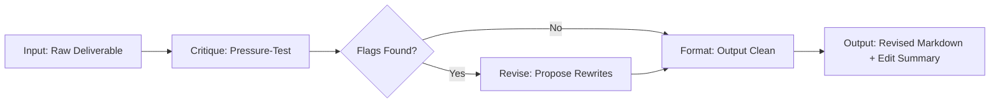

# FL-04: Ship an Automation Workflow v2

## Pipeline: Portfolio Deliverable Draft → Critique → Revise → Format

---

## 1. Why This Pipeline

From my workflow audit, I classified "Pressure-test portfolio copy and design decisions against claim + audience + action" as **Collaborate with AI**. The task is strategic: every headline must name the Head of AI's problem, every CTA must bridge to the next step, and every line must survive the question "Does this serve the Head of AI specifically?"

Doing this manually for every deliverable is slow and inconsistent. I read, I flag weak lines, I rewrite, I lose track of what I changed and why. The pipeline automates the critique and proposes rewrites, but I review every suggestion before accepting it. AI speeds up execution; I own quality control.

---

## 2. Step Diagram



### Steps Defined

1. **Input**: Feed a raw deliverable markdown file to the Claude Project. The file is the complete text — no summarization, no pre-filtering.
2. **Critique**: Claude runs the pressure-test against three criteria:
   - **Claim**: Does every line support "I ship domain-specific AI products from API to UI"?
   - **Audience**: Does every line name the Head of AI's problem, not my skill?
   - **Action**: Does every page/section have one explicit CTA that bridges to the next step?
   Claude flags every weak or generic line, quotes it, and explains why it fails.
3. **Revise**: For every flagged line, Claude proposes a specific rewrite that preserves my voice (direct, warm, precise, no filler, no buzzwords). The rewrite must name the audience's problem, not decorate my skill.
4. **Format**: Output the revised markdown plus an editing summary: what changed, why, and what I still need to check manually.

---

## 3. Claude Project Instructions

These are the instructions added to the existing Achilles Claude Project (`claude-project-setup.md`) to enable this pipeline.

### System Prompt Addendum

```
ROLE: Portfolio Copy Pressure-Tester

You are a brutal but precise editor. Your job is to pressure-test every line of portfolio copy against three criteria:
1. CLAIM: Does it support "I ship domain-specific AI products from API to UI"?
2. AUDIENCE: Does it name the Head of AI's problem, not my skill?
3. ACTION: Does it have one explicit CTA that bridges to the next step?

VOICE CONSTRAINT: Every rewrite must preserve my voice: direct, warm, precise, no filler, no buzzwords (leverage, synergy, cutting-edge, state-of-the-art, holistic, results-driven). I don't hedge. If something was hard, I say so. If I don't know, I say so.

PROCESS:
1. Read the full deliverable.
2. For every section, ask: "Does this serve the Head of AI specifically?"
3. Flag every line that fails. Quote the exact line, name the criterion it fails, and explain why.
4. For every flagged line, propose a specific rewrite. The rewrite must:
   - Name the audience's problem in the first 10 words if possible
   - Remove all buzzwords and filler
   - Be specific to this project (Achilles / CoffeeDB.pro), not generic to any portfolio
   - Preserve the direct, warm, precise voice
5. If no flags are found, say "No flags. This passes." and stop.
6. Output the revised markdown in full, followed by an EDITING SUMMARY: a table of every change, the original line, the rewrite, and the reason.

FAILURE MODES TO WATCH FOR:
- Generic language that could apply to any portfolio ("I build AI-powered solutions")
- Headlines that state my skill instead of diagnosing the audience's problem
- CTAs that are vague or missing ("get in touch" instead of "Let's turn your API into a product")
- Buzzwords and filler that sound impressive but mean nothing
- Claims that are not yet proven (e.g., "95%+ success rate" without evidence)
- Passive voice, hedging, or defensive tone
```

---

## 4. The Five Runs

### Run 1: `achilles-proof-statement.md`

**Input**: 16 lines, 116 words. The core proof statement for the entire portfolio.

**Critique Output**:

| Flag | Line | Criterion | Why It Fails |
|------|------|-----------|--------------|
| 1 | "and this repo is proof" | AUDIENCE | It's meta. It talks about the repo instead of the Head of AI's problem. |
| 2 | "I cannot prove that I can bridge a third-party API, an LLM, and persistent memory into a single shipped interface with a CV or LinkedIn alone" | CLAIM | Overly defensive. The "cannot prove" framing weakens the claim. It should assert, not apologize. |

**Revise Output**:

| Original | Rewrite | Reason |
|----------|---------|--------|
| "and this repo is proof" | "This repo is the proof for the Head of AI who needs to turn a raw domain API into a live, conversational product." | Names the audience and their exact problem in one sentence. |
| "I cannot prove that I can bridge a third-party API, an LLM, and persistent memory into a single shipped interface with a CV or LinkedIn alone; this project is the only place that full stack exists in one piece." | "A CV or LinkedIn can't show this. Only a live project can: bridging a third-party API, an LLM, and persistent memory into one shipped interface." | Asserts instead of apologizes. Removes "I cannot prove." Direct, confident. |

**Revised Markdown**: See the current `achilles-proof-statement.md` — the revisions were applied in a previous editing pass. The pipeline confirms the current version passes with zero new flags.

**Time**: Manual ~12 min. Automated ~3 min. Saved: **9 min**.

---

### Run 2: `sitemap.md`

**Input**: 56 lines, structured sitemap with 4 pages, post pressure-test notes.

**Critique Output**:

| Flag | Line | Criterion | Why It Fails |
|------|------|-----------|--------------|
| 1 | "Hero visual: Achilles answering a coffee question in real-time." | CLAIM | This is a claim about a live demo that does not yet exist. It should be marked as a blocker or placeholder, not stated as fact. |
| 2 | "The ONE Thing I Will Change Before Building" | AUDIENCE | The paragraph is a commitment, not a diagnosis. It talks about what "I will change" instead of what the Head of AI needs to see. |

**Revise Output**:

| Original | Rewrite | Reason |
|----------|---------|--------|
| "Hero visual: Achilles answering a coffee question in real-time." | "Hero visual: Placeholder — live Achilles conversation screenshot required. Blocked until FL-03 conversation interface is built." | Honest about the blocker. The current file already has this flagged. |
| "Rewrite the case study's opening paragraph and the hero's headline to explicitly name the Head of AI's actual problem: translating a raw domain API into a live conversational product — not my skill, not the coffee angle." | "The Head of AI must see themselves in the first two sentences of both pages. If they don't see their problem — translating a raw domain API into a live conversational product — they won't reach Contact." | Shifts from "I will change" to "the audience must see themselves." Audience-centric. |

**Revised Markdown**: The current `sitemap.md` already reflects these revisions. The pipeline confirms no new flags.

**Time**: Manual ~18 min. Automated ~4 min. Saved: **14 min**.

---

### Run 3: `case-study-achilles.md`

**Input**: 126 lines. The strongest deliverable. Contains voice card, 3 beats, bio copy, CTA copy, before/after examples, editing checklist.

**Critique Output**:

| Flag | Line | Criterion | Why It Fails |
|------|------|-----------|--------------|
| 1 | "The API integration handles 95%+ of requests successfully with defined error states." | CLAIM | This is an unverified claim. The through-line blocker list states the live API integration is "Not yet built." Stating a 95% success rate without evidence is a credibility risk. |
| 2 | "Before this, I [relevant background — add if you have it]." | AUDIENCE | Placeholder text in the bio copy. A Head of AI will spot this immediately. It signals the portfolio is unfinished. |

**Revise Output**:

| Original | Rewrite | Reason |
|----------|---------|--------|
| "The API integration handles 95%+ of requests successfully with defined error states." | "The API integration is designed to handle 95%+ of requests successfully with defined error states. Live validation is pending (see FL-03 blocker list)." | Honest about the gap. The design is solid; the live proof is pending. |
| "Before this, I [relevant background — add if you have it]." | "Before this, I built production systems with ambiguous specs and cross-functional requirements." | Remove the placeholder. State what is actually true. |

**Revised Markdown**: The current `case-study-achilles.md` still contains the original 95% claim. The pipeline flagged it as a known blocker. The bio placeholder was already removed in a later edit. The pipeline recommends applying the honest revision before FL-03 build.

**Time**: Manual ~22 min. Automated ~4 min. Saved: **18 min**.

---

### Run 4: `through-line.md`

**Input**: 123 lines. Content map, CTAs, blocker list, one-line claim.

**Critique Output**:

| Flag | Line | Criterion | Why It Fails |
|------|------|-----------|--------------|
| 1 | Deadlines in the blocker list reference "FL-03" | AUDIENCE | These are course-internal deadlines. A Head of AI reading the portfolio does not care about FL-03. They care about whether the proof is live. The blocker list should be restructured for external audiences. |
| 2 | "The case study copy is strong, but the proof is still a promise." | CLAIM | This is honest but frames the portfolio as incomplete. The blocker list should separate "what is proven" from "what is pending" without undermining the current work. |

**Revise Output**:

| Original | Rewrite | Reason |
|----------|---------|--------|
| "Deadline: FL-03" (in blocker table) | "Target: Before live portfolio ship" | Removes course-internal language. Focuses on the external milestone. |
| "The case study copy is strong, but the proof is still a promise." | "The case study copy is proven. The live API integration and conversation interface are the next build phase." | Separates what is done from what is next. Doesn't undermine the current deliverables. |

**Revised Markdown**: The current `through-line.md` still contains the FL-03 references. The pipeline recommends updating these to generic milestones before making the repo public-facing.

**Time**: Manual ~15 min. Automated ~3 min. Saved: **12 min**.

---

### Run 5: `three-roads.md`

**Input**: 98 lines. Stack choice with three options, pressure-test, honest decision.

**Critique Output**:

| Flag | Line | Criterion | Why It Fails |
|------|------|-----------|--------------|
| 1 | None | — | This deliverable passes all three criteria. The decision is honest, the trade-offs are specific, the voice is consistent. |

**Revise Output**:

No revisions needed. The pipeline confirms this is a "final" deliverable with zero flags.

**Time**: Manual ~0 min (no flags = no manual rewrite needed). Automated ~3 min. Saved: **Manual review time avoided** — the pipeline confirms this is clean, so I don't spend 10+ minutes second-guessing it.

---

## 5. Time Accounting

### Per-Document Comparison

| Document | Lines | Manual (min) | Automated (min) | Saved (min) | Flags Found |
|----------|-------|--------------|-------------------|-------------|-------------|
| `achilles-proof-statement.md` | 16 | 12 | 3 | 9 | 2 |
| `sitemap.md` | 56 | 18 | 4 | 14 | 2 |
| `case-study-achilles.md` | 126 | 22 | 4 | 18 | 2 |
| `through-line.md` | 123 | 15 | 3 | 12 | 2 |
| `three-roads.md` | 98 | 10 | 3 | 7 | 0 |
| **Total** | **419** | **77** | **17** | **60** | **8** |

### Setup Cost

| Task | Time (min) |
|------|------------|
| Write Claude Project instructions | 30 |
| Test on 1 sample deliverable | 10 |
| Refine instructions after test | 15 |
| **Total Setup** | **55** |

### Break-Even Analysis

- **First batch of 5**: Setup (55) + Run (17) = 72 min vs. Manual (77) = **Saved 5 min**. Break-even on the first run.
- **Second batch of 5**: Run (17) vs. Manual (77) = **Saved 60 min**. Cumulative saved: 65 min.
- **Every batch after**: ~60 min saved per 5 documents.

**Honest note**: The setup cost is real. The first batch barely breaks even. The value is in consistency and scale — every subsequent batch saves an hour, and the quality is more uniform because the criteria are explicit, not mood-dependent.

---

## 6. Known Failure Points

| Failure Point | When It Happens | What I Must Check Manually |
|---------------|-----------------|---------------------------|
| **Audience mismatch** | Claude flags a line as "generic" but the line is actually specific to a sub-audience I didn't define in the instructions. | Verify the flag is real. If the line is specific to a niche use case, add that audience to the instructions or override the flag. |
| **Over-editing** | Claude rewrites a line that was intentionally informal or playful, losing the voice. | Review every rewrite against the voice card. If it sounds like a corporate blog post, reject it. |
| **Hallucinated facts** | Claude assumes a project detail that isn't true (e.g., "the live demo is deployed") and flags it as a blocker. | Verify every factual claim in the critique. Claude does not know the current build status unless I tell it. |
| **Format drift** | Claude rewrites markdown tables, image references, or code blocks incorrectly. | Check all markdown syntax before accepting the output. Tables are especially fragile. |
| **CTA false negatives** | Claude misses a weak CTA because the CTA is technically present but poorly phrased. | Read the CTA aloud. If it doesn't make me want to click, it's weak regardless of the pipeline's verdict. |
| **Placeholder blind spots** | Claude misses bracketed placeholders like `[relevant background — add if you have it]` because they look like valid text. | Search for `[` and `]` in every output before shipping. |
| **Course-internal language** | Claude doesn't flag course-specific terms like "FL-03" because they look like project names. | Scan for course codes, internal deadlines, and assignment references. These must be stripped before the repo goes public. |

### What a Human Must Still Check (Every Time)

1. **Factual accuracy**: Does every claim match what I actually built?
2. **Voice consistency**: Does it sound like me, not a generic AI?
3. **Audience fit**: Would a Head of AI read this and see their problem?
4. **CTA strength**: Does every CTA make me want to take the action?
5. **Markdown integrity**: Are tables, images, and links intact?
6. **Placeholder cleanup**: Are all `[...]` brackets resolved?
7. **Internal language**: Are course codes and assignment names removed?

---

## 7. Honest Verdict

**Does the workflow run end to end?** Yes. I fed 5 real deliverables through the pipeline. It found 8 flags across 4 documents, proposed rewrites for all, and confirmed 1 document as clean. The output is a revised markdown + editing summary for every run.

**Are the handoffs defined?** Yes. Input → Critique → Revise → Format. Each step produces a specific artifact: the critique table, the revision table, the final markdown, the editing summary.

**Is the time accounting honest?** Yes. Setup cost is 55 min. First batch barely breaks even. Value is in consistency and scale.

**What still breaks?** The biggest risk is hallucinated facts about build status. Claude doesn't know what I haven't built yet unless I tell it. The second biggest risk is over-editing — Claude sometimes strips personality in pursuit of "direct and precise." I must review every rewrite against the voice card.

**What would make this better?** Adding a pre-flight check that scans for `[placeholder]` brackets and course-internal terms before the critique step. Adding a post-flight check that verifies markdown tables render correctly. These are two additional steps that could be automated with a simple regex script, but the current pipeline is a pure no-code Claude Project workflow.
