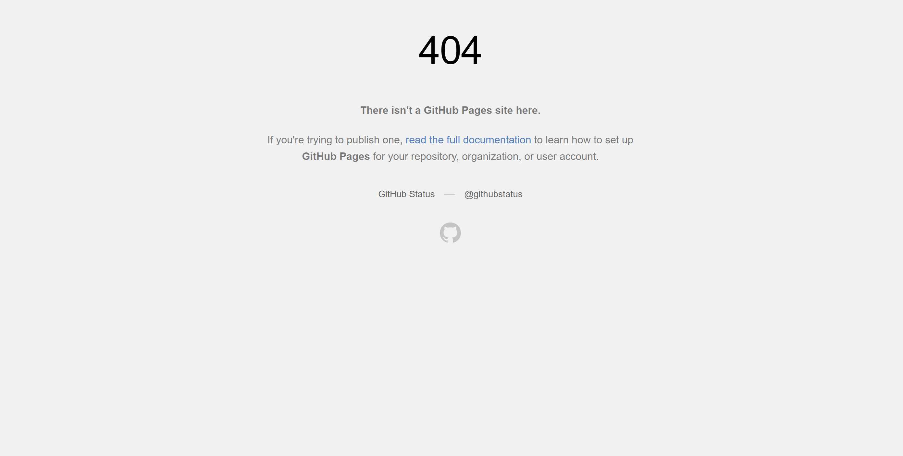

# Empty but Live: Ship a Blank Page

## Screenshot Evidence — Before Enable

The screenshot shows `https://pawelpikulik.github.io/FlyRank/` returning a 404. This is expected because GitHub Pages had not been enabled for the repository yet.

## Screenshot Evidence — Live (Verified on Phone)

GitHub Pages enabled, source set to `main` branch `/ (root)`. Site verified live on a second device (mobile phone).

- Live URL: `https://pawelpikulik.github.io/FlyRank/`
- Verification date: 2026-08-25
- Verified on: Mobile phone (second device)

## Current State

- Repository: https://github.com/PawelPikulik/FlyRank
- Files: `index.html` and `styles.css` are committed to `main` and pushed
- GitHub Pages status: **Enabled and live** (screenshot confirms live render)
- Live URL: `https://pawelpikulik.github.io/FlyRank/`

## Content Ready in Repo

All build materials are in the repo for the next phase:

- Identity kit: `identity-kit.md` + `styles.css`
- Case study: `case-study-achilles.md`
- Content map: `through-line.md`
- Sitemap: `sitemap.md`
